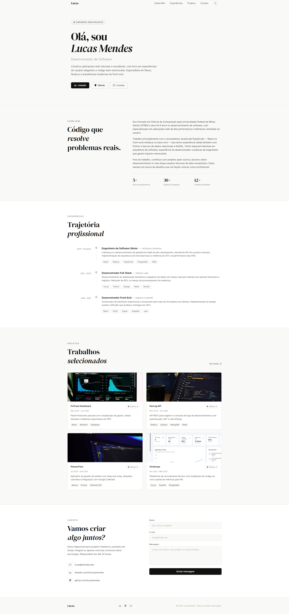
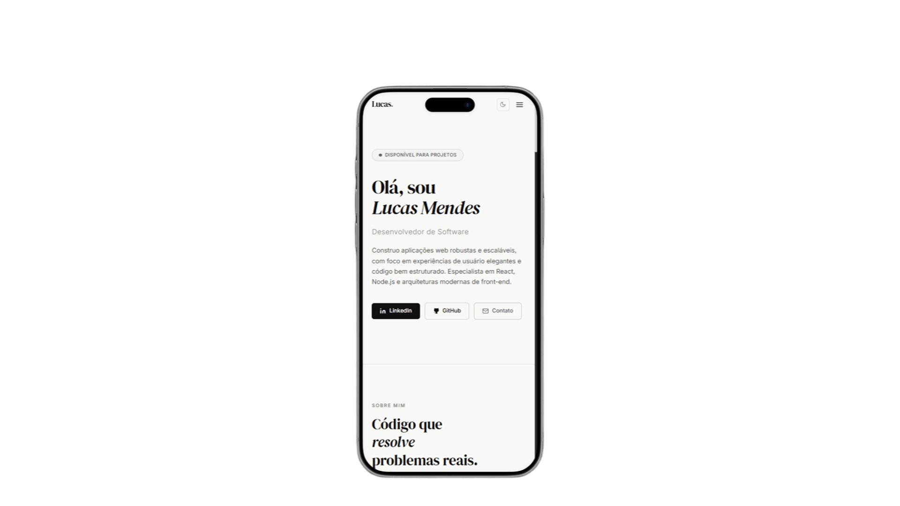
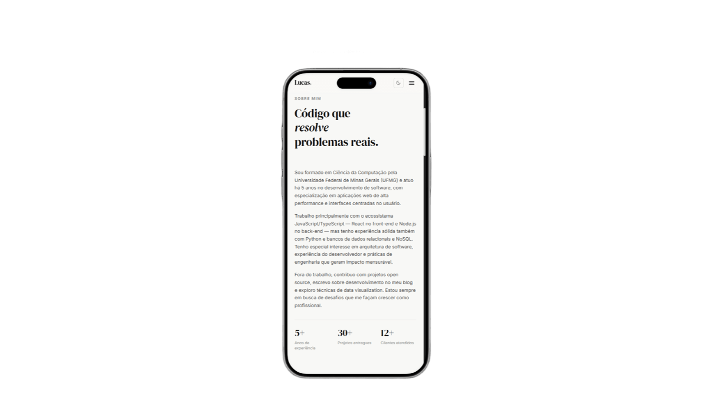
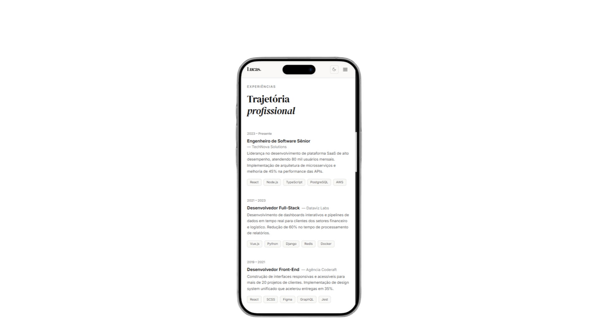
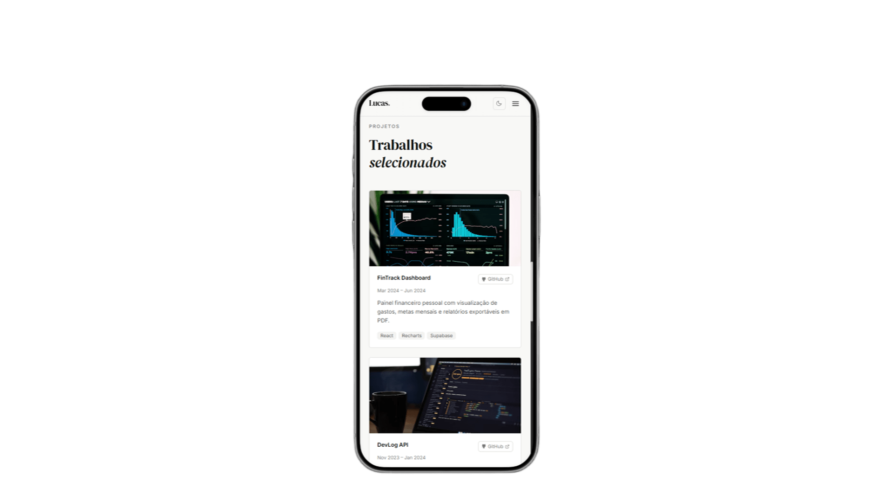
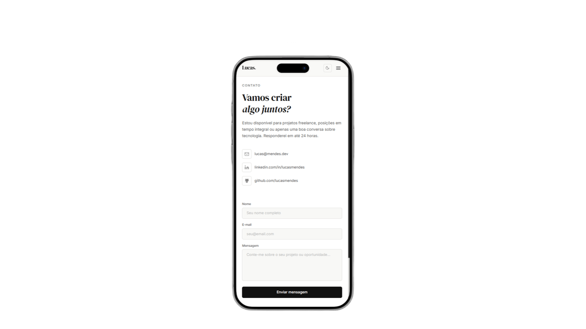

# Portfólio Profissional - Samuel Rebula

> Um portfólio moderno, responsivo e totalmente personalizável desenvolvido com React, TypeScript e Tailwind CSS.

## Descrição do Projeto

Este é um portfólio profissional desenvolvido como parte da disciplina **Laboratório de Desenvolvimento de Software** na **PUC Minas**. O projeto apresenta minhas experiências, habilidades, projetos desenvolvidos e informações de contato em uma interface moderna e responsiva.

**Características principais:**

- Design moderno e limpo
- Modo escuro/claro com alternância suave
- Alternância de idioma entre português e inglês
- Totalmente responsivo (mobile, tablet, desktop)
- Navegação suave com scroll para seções
- Menu hambúrguer em dispositivos móveis
- Links funcionais para redes sociais e contato

## Protótipos e Design

Os wireframes do projeto estão disponíveis localmente na pasta [public/images](public/images) e foram usados como referência para a estrutura visual e a organização das seções. As imagens e vídeos dos projetos ficam em [public/images/ref](public/images/ref).

- **Wireframes**: estrutura base das seções e componentes
- **Design System**: paleta de cores, tipografia (DM Serif Display e Inter), espaçamento
- **Componentes**: botões, cards, formulários, ícones SVG personalizados
- **Temas**: duas variações (claro/escuro) com transições suaves

### Wireframes

#### Wireframe principal



#### Wireframe mobile - Hero



#### Wireframe mobile - Sobre mim



#### Wireframe mobile - Experiência



#### Wireframe mobile - Projetos



#### Wireframe mobile - Contato



## Tecnologias Utilizadas

| Tecnologia            | Versão | Propósito                                             |
| --------------------- | ------ | ----------------------------------------------------- |
| **React**             | 19.2.8 | Framework de UI com componentes reutilizáveis e hooks |
| **Vite**              | 8.2.1  | Build tool com dev server rápido e HMR                |
| **TypeScript**        | ~6.0.2 | Type safety e melhor developer experience             |
| **Tailwind CSS**      | v4     | Utility-first CSS framework para estilização          |
| **PostCSS**           | Latest | Processamento CSS com Autoprefixer                    |
| **React Context API** | Native | Gerenciamento de estado do tema (dark/light)          |

## Estrutura do Projeto

```
portifolio/
├── src/
│   ├── components/           # Componentes React reutilizáveis
│   │   ├── Header.tsx        # Navegação com menu responsivo
│   │   ├── Hero.tsx          # Seção principal com CTA
│   │   ├── About.tsx         # Sobre mim com estatísticas
│   │   ├── Experience.tsx    # Timeline de experiências profissionais
│   │   ├── Projects.tsx      # Grid de projetos
│   │   ├── ProjectCard.tsx   # Card individual de projeto
│   │   ├── Contact.tsx       # Formulário de contato
│   │   ├── Footer.tsx        # Rodapé com links sociais
│   │   ├── Layout.tsx        # Wrapper principal
│   │   └── SectionLabel.tsx  # Label reutilizável
│   │
│   ├── hooks/                # Custom React hooks
│   │   ├── ThemeContext.ts   # Contexto de tema e idioma
│   │   ├── ThemeProvider.tsx # Provider do contexto
│   │   └── useTheme.tsx      # Hook para usar o tema
│   │
│   ├── icons/                # Ícones SVG personalizados
│   │   └── index.tsx         # LinkedIn, GitHub, Mail, Menu, Sun, Moon
│   │
│   ├── constants/            # Dados e traduções
│   │   ├── content.ts        # NAV_LINKS, EXPERIENCES, PROJECTS
│   │   └── translations.ts   # Textos em português e inglês
│   │
│   ├── types/                # Tipos TypeScript
│   │   └── index.ts          # NavLink, Experience, Project
│   │
│   ├── styles/               # Estilos globais
│   │   └── globals.css       # Tailwind CSS + Google Fonts
│   │
│   ├── App.tsx               # Componente raiz
│   └── main.tsx              # Ponto de entrada
│
├── public/                   # Assets estáticos
├── package.json              # Dependências e scripts
├── vite.config.ts            # Configuração do Vite
├── tsconfig.json             # Configuração TypeScript
├── tailwind.config.js        # Configuração Tailwind v4
├── postcss.config.js         # Configuração PostCSS
└── README.md                 # Este arquivo
```

## Como Usar

### Pré-requisitos

- Node.js >= 18.0.0
- npm >= 11.0.0

### Instalação

```bash
# Clone o repositório
git clone https://github.com/samuelrebula/portifolio.git
cd portifolio

# Instale as dependências
npm install
```

### Desenvolvimento

```bash
# Inicie o servidor de desenvolvimento
npm run dev

# Acesse em http://localhost:5174/
```

O servidor está configurado com:

- Hot Module Replacement (HMR) - Atualização automática de componentes
- TypeScript strict mode
- Fast Refresh - Atualizações de estado preservadas

### Build para Produção

```bash
# Gere a build otimizada
npm run build

# Visualize a build localmente
npm run preview
```

## Seções do Portfólio

### 1. **Header** (`Header.tsx`)

- Navegação com links para seções
- Menu hambúrguer responsivo (mobile)
- Toggle de tema (dark/light mode)
- Detecção de scroll sticky

### 2. **Hero** (`Hero.tsx`)

- Apresentação pessoal
- Subtitle: "Software Developer"
- Botões CTA:
  - LinkedIn: linkedin.com/in/samuel-rebula
  - GitHub: github.com/samuelrebula
  - Email: rebuuula@gmail.com

### 3. **About** (`About.tsx`)

- Biografia profissional em português e inglês

### 4. **Experience** (`Experience.tsx`)

- Timeline com experiências profissionais
- Tech stack para cada role (React Native, .NET, TypeScript, Azure, etc.)

### 5. **Projects** (`Projects.tsx`)

- Grid responsivo de projetos
- Cada projeto com:
  - Imagem ou vídeo em loop, nome e período
  - Descrição e tech stack
  - Link para GitHub ou projeto publicado

### 6. **Contact** (`Contact.tsx`)

- Informações de contato
- Canais diretos: Email, LinkedIn, GitHub
- Formulário de mensagem com validação básica e abertura do cliente de e-mail via `mailto:`

### 7. **Footer** (`Footer.tsx`)

- Logo/branding
- Links sociais
- Copyright dinâmico

## Tema e Estilos

**Paleta de Cores:**

| Elemento       | Claro   | Escuro  |
| -------------- | ------- | ------- |
| Background     | #FFFFFF | #1A1A1A |
| Text Primary   | #111111 | #FFFFFF |
| Text Secondary | #555555 | #AAAAAA |
| Border         | #E2E2E0 | #333333 |
| Accent         | #111111 | #FFFFFF |

**Tipografia:**

- **Display**: DM Serif Display (títulos)
- **Body**: Inter (textos)

**Responsividade:**

- Mobile-first approach
- Breakpoints: sm (640px), md (768px), lg (1024px)
- Menu hambúrguer em telas < 768px

## Tema e Idioma

O tema e o idioma são gerenciados via **React Context API**:

```tsx
// ThemeContext.ts - Definições de tipo
export interface ThemeContextType {
  dark: boolean;
  toggleDark: () => void;
  language: "pt" | "en";
  toggleLanguage: () => void;
}

// ThemeProvider.tsx - Componente provider
export function ThemeProvider({ children }) { ... }

// useTheme.tsx - Hook customizado
export function useTheme() { ... }

// Uso em qualquer componente
const { dark, language, toggleLanguage } = useTheme();
```

Esta separação permite **Fast Refresh** perfeito durante desenvolvimento.

## Configurações Importantes

### TypeScript (`tsconfig.json`)

- `strict: true` - Type checking rigoroso
- `verbatimModuleSyntax: true` - Import/export claros
- `jsx: "react-jsx"` - JSX automático do React 19

### Tailwind (`tailwind.config.js`)

- Versão 4 com @tailwindcss/postcss
- Custom font-display class
- Content paths configurados

### Vite (`vite.config.ts`)

- React plugin com Babel compiler
- Otimizações de build automáticas

## Dados e Traduções

Os dados de navegação, experiências e projetos ficam em `constants/content.ts`. Os textos da interface ficam centralizados em `constants/translations.ts`:

```tsx
export const NAV_LINKS = [...]
export const EXPERIENCES = [...]
export const PROJECTS = [...]
export const translations = { pt: {...}, en: {...} }
```

Fácil manutenção e atualização sem mexer em componentes.

## Contato

- **Email**: rebuuula@gmail.com
- **LinkedIn**: linkedin.com/in/samuel-rebula
- **GitHub**: github.com/samuelrebula

---

**Desenvolvido por Samuel Rebula**  
Laboratório de Desenvolvimento de Software - PUC Minas
